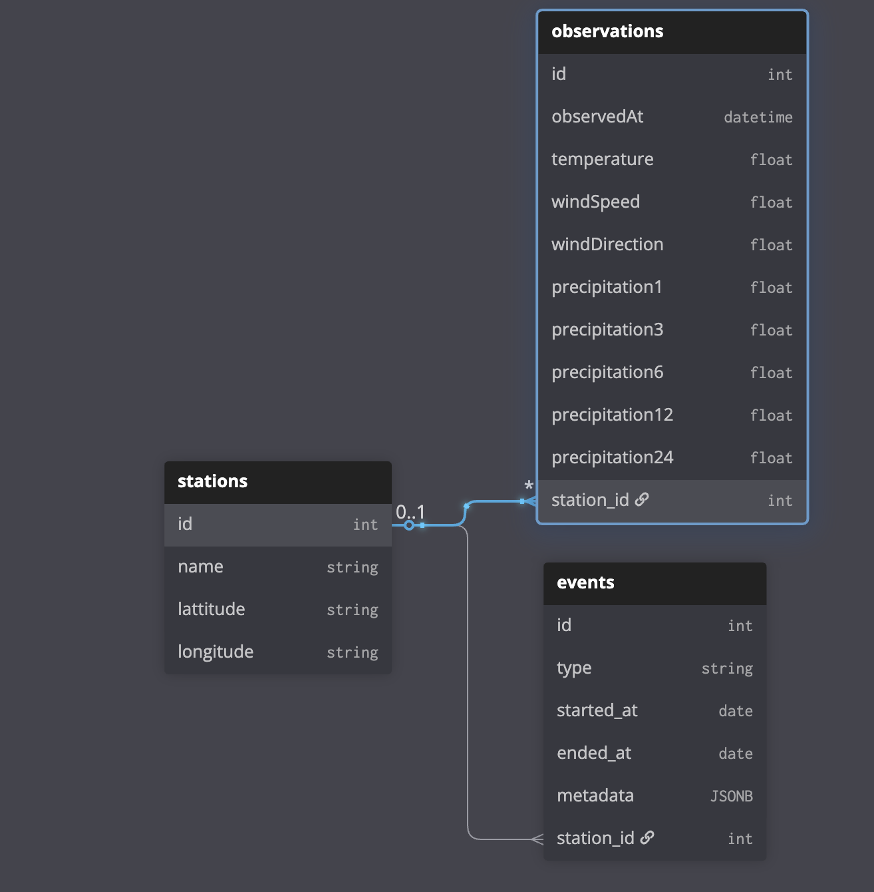

# Platform Météo

| Route | Champs retournés |
|---|---|
| GET /station/infrahoraire-6m | Id_station;Date;Latitude;Longitude;Nom;Parametres_observation;Valeurs_mesurees |
| GET /station/horaire | Id_station;Date;Latitude;Longitude;Nom;Parametres_observation;Valeurs_mesurees |
| GET /liste-stations | Id_station;Id_omm;Nom_usuel;Latitude;Longitude;Altitude;Date_ouverture;Pack |
| GET /liste-stations-synop | Id_station;Nom;Latitude;Longitude;Altitude |
| GET /synop | Id_station;Date;Pression;Temperature;Humidite;Direction_vent;Vitesse_vent;Nebulosite;Visibilite;Precipitations |
| GET /liste-bouees | Id_bouee;Nom;Latitude;Longitude;Altitude;Date_ouverture |
| GET /bouees | Id_bouee;Date;Temperature_air;Temperature_eau;Pression;Vitesse_vent;Direction_vent;Hauteur_vagues |

Data json a ingest, champ à garder et leur correspondance : 

| Json Key      | Correspondance en fr                        | Unité                             |
|---------------|---------------------------------------------|-----------------------------------|
| lat           | latitude                                    | degré                             |
| long          | longitude                                   | degré                             |
| name          | nom de la ville                             |                                   |
| validity_time | date et heure de la mesure                  | ISO 8601/UTC AAAA-MM-DDTHH:MM:SSZ |
| geo_id_wmo    | id de la ville                              |                                   |
| t             | température en Kelvin                       | Kelvin                            |
| ff            | vitesse du vent moyen en mettre par seconde | m/s                               |
| dd            | direction du bent                           | degré                             |
| rr1           | précipitations sur la dernière heure en     | mm                                |
| rr3           | précipitations sur les 3 dernière heure en  | mm                                |
| rr6           | précipitations sur les 6 dernière heure en  | mm                                |
| rr12          | précipitations sur les 12 dernière heure en | mm                                |
| rr24          | précipitations sur les 24 dernière heure en | mm                                |

Schema de bdd :
