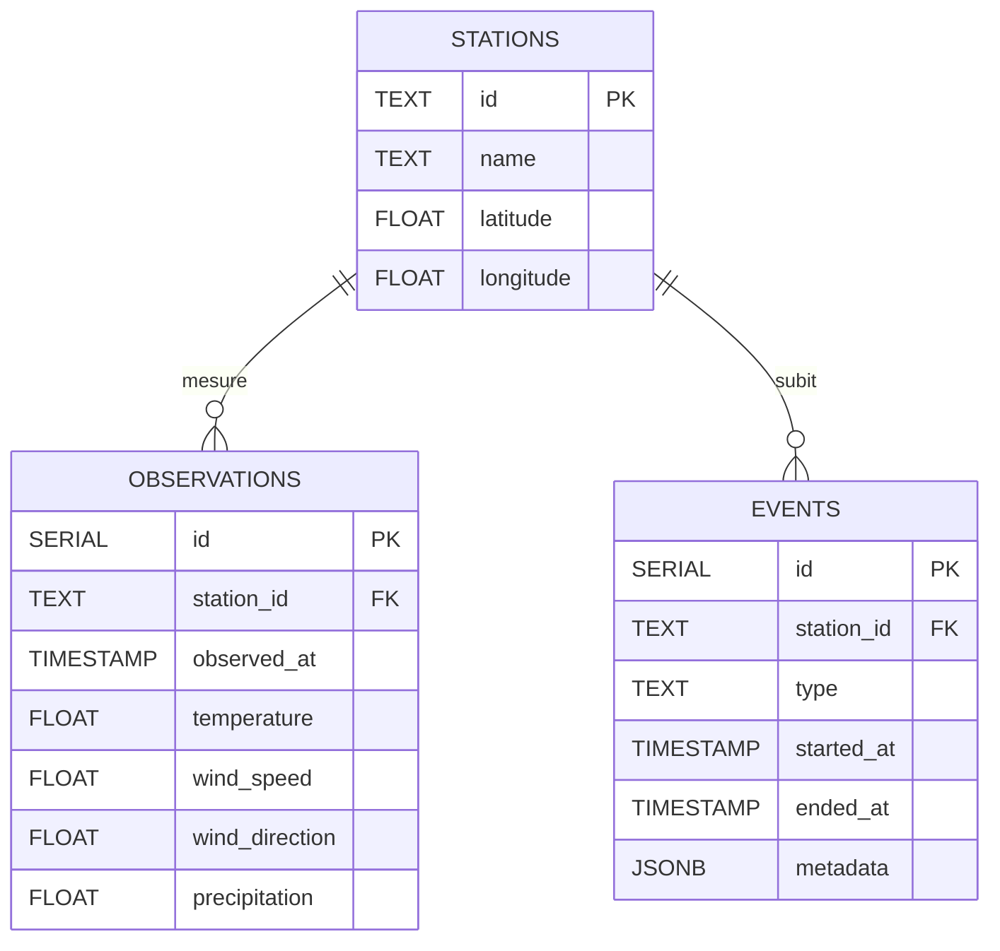

# Flux de Données Météo-France (Data.gouv.fr)

Ce document détaille la structure des flux de données fournis par Météo-France sur la plateforme Data.gouv.fr, ainsi que la correspondance des champs (mapping) et la structure de la base de données.

---

## 1. Routes et Flux Disponibles chez Météo-France

Météo-France expose plusieurs jeux de données (API et fichiers CSV) selon la précision temporelle et le type de capteur :

| Route / Flux | Description des champs retournés |
| :--- | :--- |
| `GET /station/infrahoraire-6m` | Données infra-horaires (toutes les 6 minutes) : `Id_station;Date;Latitude;Longitude;Nom;Parametres_observation;Valeurs_mesurees` |
| `GET /station/horaire` | Données horaires : `Id_station;Date;Latitude;Longitude;Nom;Parametres_observation;Valeurs_mesurees` |
| `GET /liste-stations` | Répertoire global des stations météorologiques : `Id_station;Id_omm;Nom_usuel;Latitude;Longitude;Altitude;Date_ouverture;Pack` |
| `GET /liste-stations-synop` | Répertoire spécifique des stations du réseau SYNOP : `Id_station;Nom;Latitude;Longitude;Altitude` |
| **`GET /synop`** *(Actuel)* | Données d'observations synoptiques périodiques : `Id_station;Date;Pression;Temperature;Humidite;Direction_vent;Vitesse_vent;Nebulosite;Visibilite;Precipitations` |
| `GET /liste-bouees` | Liste des stations de mesures maritimes (bouées) : `Id_bouee;Nom;Latitude;Longitude;Altitude;Date_ouverture` |
| `GET /bouees` | Données physiques mesurées par les bouées : `Id_bouee;Date;Temperature_air;Temperature_eau;Pression;Vitesse_vent;Direction_vent;Hauteur_vagues` |

> [!NOTE]
> Actuellement, la plateforme se concentre sur l'ingestion du flux **SYNOP** (données d'observations en temps réel et historiques).

---

## 2. Correspondance des Champs (Mapping & Ingestion)

Le tableau suivant montre les clés brutes reçues de l'API Data.gouv.fr, leur signification en français, leur unité d'origine, et comment elles sont intégrées ou converties dans notre système :

| Clé JSON/CSV | Description | Unité d'origine | Mapping / Traitement dans l'application |
| :--- | :--- | :--- | :--- |
| **`geo_id_wmo`** | Identifiant unique de la station | Texte | Clé primaire unique : `Station.Id` et référence `Observation.StationId` |
| **`name`** | Nom usuel de la station | Texte | Nom de la ville/station : `Station.Name` |
| **`lat`** | Latitude de la station | Degrés décimaux | Coordonnée géographique : `Station.Latitude` |
| **`lon`** | Longitude de la station | Degrés décimaux | Coordonnée géographique : `Station.Longitude` |
| **`validity_time`**| Date et heure UTC de la mesure | ISO 8601 (UTC) | Horodatage de l'observation : `Observation.ObservedAt` (type `time.Time`) |
| **`t`** | Température de l'air | Kelvin | **Converti en Celsius** : $T_{\text{Celsius}} = T_{\text{Kelvin}} - 273.15$ |
| **`ff`** | Vitesse moyenne du vent | Mètres par seconde (m/s) | **Converti en km/h** : $\text{Vitesse}_{\text{km/h}} = \text{Vitesse}_{\text{m/s}} \times 3.6$ |
| **`dd`** | Direction du vent | Degrés ($0\degree$ à $360\degree$) | Stocké tel quel : `Observation.WindDirection` |
| **`rr1`** | Précipitations sur la dernière heure | mm | Quantité de pluie : `Observation.Precipitation` |
| *`rr3`* | Précipitations sur les 3 dernières heures | mm | *Non stocké actuellement* |
| *`rr6`* | Précipitations sur les 6 dernières heures | mm | *Non stocké actuellement* |
| *`rr12`* | Précipitations sur les 12 dernières heures| mm | *Non stocké actuellement* |
| *`rr24`* | Précipitations sur les 24 dernières heures| mm | *Non stocké actuellement* |

---

## 3. Schéma de la Base de Données

Les données extraites de ces flux alimentent la base de données relationnelle PostgreSQL selon le schéma suivant :



### Relations et Contraintes
- **Relation Station-Observation** : Une station météorologique enregistre plusieurs observations au fil du temps. La clé `observations.station_id` référence `stations.id`.
- **Contrainte d'unicité** : Une contrainte unique est configurée sur `(station_id, observed_at)` pour la table `observations`. Cela empêche l'enregistrement de plusieurs mesures pour une même station à une même heure.
- **Table d'événements** : Une table `events` permet d'enregistrer des événements météo spécifiques (par exemple : tempêtes, canicules) rattachés à une station, avec un champ `metadata` au format `JSONB` pour stocker des attributs variables.

---

## 4. URL de Récupération des Fichiers Historiques

L'ingesteur télécharge directement les fichiers compressés à l'adresse suivante :
```text
https://object.files.data.gouv.fr/meteofrance/data/synchro_ftp/OBS/SYNOP/synop_{ANNÉE}.csv.gz
```
En remplaçant `{ANNÉE}` par l'année souhaitée (ex. `2026`).
