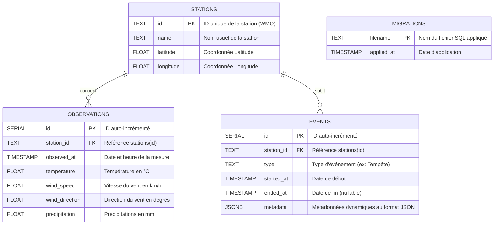

# Schéma et Modèle de la Base de Données

Ce document décrit la structure de la base de données relationnelle PostgreSQL utilisée par la plateforme, ainsi que sa correspondance avec les modèles structurés (structs) définis en Go.

---

## 1. Choix Technologiques
- **SGBD** : PostgreSQL 15 (exécuté sous l'image Docker `postgres:15-alpine` en développement).
- **Driver Go** : [`github.com/lib/pq`](https://github.com/lib/pq) (driver SQL standard pour PostgreSQL).
- **ORM** : Aucun (requêtes SQL brutes via le package natif `database/sql` pour une performance optimale et un contrôle total des requêtes).

---

## 2. Diagramme Global des Tables (Modèle Relationnel)

Voici le schéma global représenté à partir des fichiers SQL de migration :



---

## 3. Détail des Tables et Mappings Go

Les modèles Go sont centralisés dans le fichier [`internal/model/model.go`](file:///Users/matteo/GolandProjects/awesomeProject/platform-meteo/internal/model/model.go).

### A. Table `stations`
Contient la liste des stations météorologiques enregistrées.

| Nom Colonne SQL | Type SQL | Contrainte | Champ Go (`model.Station`) | Type Go |
| :--- | :--- | :--- | :--- | :--- |
| `id` | `TEXT` | `PRIMARY KEY` | `Id` | `string` |
| `name` | `TEXT` | `NOT NULL` | `Name` | `string` |
| `latitude` | `FLOAT` | `NULL` | `Latitude` | `float64` |
| `longitude` | `FLOAT` | `NULL` | `Longitude` | `float64` |
| *N/A* | *N/A* | *N/A* | `Country` | `string` |

> [!WARNING]
> **Écart Modèle/SQL** : La structure Go `model.Station` possède un champ `Country` (pays) qui n'est pas présent dans la table SQL `stations` ni écrit lors des requêtes d'insertion (`storage.InsertStation`).

### B. Table `observations`
Contient l'historique des mesures météorologiques horaires pour chaque station.

| Nom Colonne SQL | Type SQL | Contrainte | Champ Go (`model.Observation`) | Type Go |
| :--- | :--- | :--- | :--- | :--- |
| `id` | `SERIAL` | `PRIMARY KEY` | `Id` | `int` |
| `station_id` | `TEXT` | `FOREIGN KEY` (réf `stations.id`) | `StationId` | `string` |
| `observed_at` | `TIMESTAMP`| `NOT NULL` | `ObservedAt` | `time.Time` |
| `temperature` | `FLOAT` | `NULL` | `Temperature` | `float64` |
| `wind_speed` | `FLOAT` | `NULL` | `WindSpeed` | `float64` |
| `wind_direction` | `FLOAT` | `NULL` | `WindDirection` | `float64` |
| `precipitation` | `FLOAT` | `NULL` | `Precipitation` | `float64` |

#### Index et Contraintes spécifiques :
- **Clé d'unicité `unique_observation`** : Créée par la migration `0002_constraints.sql`.
  ```sql
  ALTER TABLE observations ADD CONSTRAINT unique_observation UNIQUE (station_id, observed_at);
  ```
  Cette contrainte empêche l'existence de plusieurs relevés pour une même station à une date/heure donnée. C'est elle qui permet d'utiliser le dédoublonnage automatique `ON CONFLICT (station_id, observed_at) DO NOTHING` lors de l'ingestion par lots.

### C. Table `events`
Permet de consigner des alertes ou des événements météorologiques majeurs survenus dans une station.

| Nom Colonne SQL | Type SQL | Contrainte | Champ Go (`model.Event`) | Type Go |
| :--- | :--- | :--- | :--- | :--- |
| `id` | `SERIAL` | `PRIMARY KEY` | `Id` | `int` |
| `station_id` | `TEXT` | `FOREIGN KEY` (réf `stations.id`) | `StationId` | `string` |
| `type` | `TEXT` | `NOT NULL` | `Type` | `string` |
| `started_at` | `TIMESTAMP`| `NOT NULL` | `StartedAt` | `time.Time` |
| `ended_at` | `TIMESTAMP`| `NULL` | `EndedAt` | `*time.Time` (Pointeur pour gérer le NULL) |
| `metadata` | `JSONB` | `NULL` | `Metadata` | `map[string]any` |

#### Flexibilité du type `JSONB` :
Le champ `metadata` utilise le type JSON binaire de PostgreSQL. En Go, il est représenté sous forme de `map[string]any`. Cela permet de stocker des structures d'événements très hétérogènes (ex: pour une canicule, la température maximale atteinte ; pour une tempête, la vitesse de rafale maximale) sans modifier le schéma relationnel fixe de la base.

### D. Table `migrations`
Table technique gérée exclusivement par le runner de migration (`db/migrations/migration.go`). Elle n'a aucun modèle associé dans `internal/model/model.go`.

| Nom Colonne SQL | Type SQL | Contrainte | Description |
| :--- | :--- | :--- | :--- |
| `filename` | `TEXT` | `PRIMARY KEY` | Nom du fichier SQL de migration appliqué (ex: `0001_init.sql`) |
| `applied_at` | `TIMESTAMP`| `NOT NULL DEFAULT NOW()` | Date et heure de l'application de la migration |
