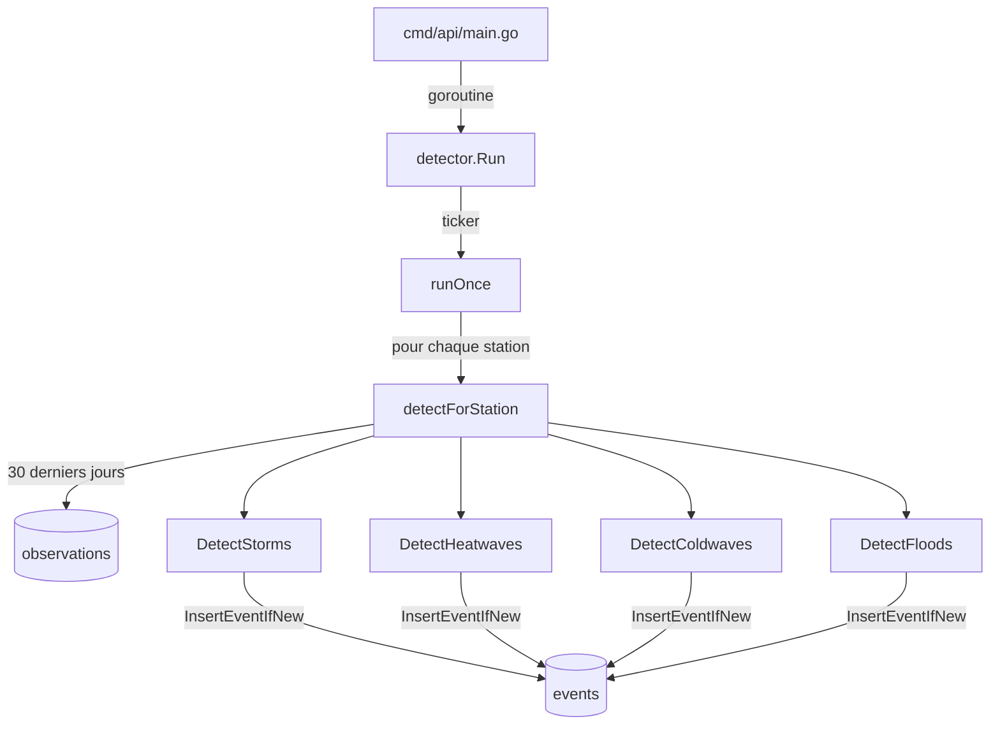

# Détecteur d'Événements Météorologiques

Ce document décrit le fonctionnement du détecteur automatique d'événements (`internal/detector`). Il analyse les observations stockées en base pour identifier des événements météorologiques significatifs (tempêtes, canicules, vagues de froid, inondations) et les persiste dans la table `events`.

---

## 1. Vue d'ensemble

Le détecteur tourne en **arrière-plan dans le serveur API** (`cmd/api`). Il s'exécute une première fois au démarrage, puis à intervalle régulier configurable.

---

## 2. Configuration

Tous les seuils sont configurables via variables d'environnement (avec valeurs par défaut) :

| Variable | Défaut | Description |
|---|---|---|
| `DETECTOR_INTERVAL_MINUTES` | `60` | Fréquence d'exécution (minutes) |
| `STORM_WIND_THRESHOLD` | `80` | Vent minimum pour une tempête (km/h) |
| `STORM_DURATION_HOURS` | `3` | Durée minimum d'une tempête (heures) |
| `HEATWAVE_TEMP_THRESHOLD` | `35` | Température max minimum pour une canicule (°C) |
| `HEATWAVE_DURATION_DAYS` | `3` | Durée minimum d'une canicule (jours) |
| `COLDWAVE_TEMP_THRESHOLD` | `0` | Température max maximum pour une vague de froid (°C) |
| `COLDWAVE_DURATION_DAYS` | `3` | Durée minimum d'une vague de froid (jours) |
| `FLOOD_PRECIP_THRESHOLD` | `50` | Précipitations sur 24h pour une inondation (mm) |

---

## 3. Types d'événements et logique de détection

### Tempête (`storm`)

Recherche des **séquences continues** d'observations où la vitesse du vent dépasse le seuil, sur une durée minimale.

- Deux observations sont considérées consécutives si l'écart est ≤ 2h
- La sévérité est calculée depuis le vent maximal de la séquence

| Sévérité | Vent max |
|---|---|
| `medium` | < 117 km/h |
| `high` | 117 – 149 km/h |
| `extreme` | ≥ 150 km/h |

**Metadata :** `max_wind_speed_kmh`, `duration_hours`

---

### Canicule (`heatwave`) et Vague de froid (`cold_wave`)

Regroupe les observations par jour (température max journalière), puis cherche des **séquences de jours consécutifs** où le seuil est dépassé.

- Une tolérance de 25h entre deux jours gère les changements d'heure (DST)

| Sévérité canicule | Temp max |
|---|---|
| `medium` | 35 – 37°C |
| `high` | 38 – 41°C |
| `extreme` | ≥ 42°C |

| Sévérité vague de froid | Temp max |
|---|---|
| `medium` | 0°C à -9°C |
| `high` | -10°C à -14°C |
| `extreme` | ≤ -15°C |

**Metadata :** `duration_days`, `peak_temperature` / `min_temperature`

---

### Inondation (`flood`)

Agrège les précipitations par **jour calendaire**. Si le total dépasse le seuil en 24h, un événement est créé.

| Sévérité | Précipitations |
|---|---|
| `medium` | 50 – 74 mm |
| `high` | 75 – 99 mm |
| `extreme` | ≥ 100 mm |

**Metadata :** `total_precipitation_mm`, `date`

---

## 5. Endpoints API

Les événements sont exposés via les routes suivantes :

| Méthode | Route | Description |
|---|---|---|
| `GET` | `/events` | Liste tous les événements (`type`, `from`, `to`, `limit`, `offset`) |
| `GET` | `/events/{id}` | Détail d'un événement par ID |
| `GET` | `/events/stats` | Comptage par type et par pays (`type`, `country`) |
| `GET` | `/stations/{id}/events` | Tous les événements d'une station |
