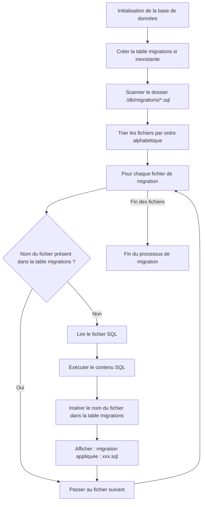

# Système de Migrations SQL "Maison"

Ce projet utilise un système de migrations de base de données ultra-léger développé en Go, situé dans le dossier [`db/migrations/`](file:///Users/matteo/GolandProjects/awesomeProject/platform-meteo/db/migrations). Ce système permet de faire évoluer le schéma de la base de données de manière ordonnée et automatique sans dépendre d'outils tiers.

---

## 1. Fonctionnement détaillé du moteur de migration

Le cœur du moteur réside dans [`db/migrations/migration.go`](file:///Users/matteo/GolandProjects/awesomeProject/platform-meteo/db/migrations/migration.go) via la fonction `Run(db *sql.DB)`. Voici les étapes exécutées :



### La table de suivi
Pour suivre les migrations appliquées, le système crée une table système dans PostgreSQL :
```sql
CREATE TABLE IF NOT EXISTS migrations (
    filename TEXT PRIMARY KEY,
    applied_at TIMESTAMP NOT NULL DEFAULT NOW()
);
```

---

## 2. Déclenchement des Migrations

Les migrations sont configurées au moment de l'initialisation de la connexion à la base de données dans [`db/connexion.go`](file:///Users/matteo/GolandProjects/awesomeProject/platform-meteo/db/connexion.go) :

- La fonction `InitDB(runMigrations bool)` prend un booléen en paramètre pour décider d'appliquer ou non les migrations au démarrage.
- **Service Ingester** ([`cmd/ingester/main.go`](file:///Users/matteo/GolandProjects/awesomeProject/platform-meteo/cmd/ingester/main.go)) : appelle `db.InitDB(true)`. **Les migrations sont donc exécutées à chaque démarrage de l'ingesteur.**
- **Service API** ([`cmd/api/main.go`](file:///Users/matteo/GolandProjects/awesomeProject/platform-meteo/cmd/api/main.go)) : appelle `db.InitDB(false)`. Les migrations ne s'exécutent pas lors du démarrage de l'API afin d'éviter les accès concurrents ou les blocages de table lors du démarrage simultané des conteneurs.

---

## 3. Guide pratique : Créer une nouvelle migration

Pour modifier la structure de la base de données (créer une table, ajouter une colonne, un index ou une contrainte), suivez ces étapes :

### Étape 1 : Choisir le nom du fichier
Le système trie les fichiers par nom de fichier avec un tri de chaînes de caractères classique (`sort.Strings`). Il est donc impératif de préfixer le fichier avec un numéro séquentiel à 4 chiffres (complété par des zéros à gauche) pour garantir l'ordre d'exécution.

*Exemple de structure existante :*
- `0001_init.sql` (Crée les tables de base)
- `0002_constraints.sql` (Ajoute la contrainte d'unicité)
- **`0003_add_indexes.sql`** (Votre nouvelle migration)

### Étape 2 : Écrire le script SQL
Créez le fichier dans `db/migrations/` et ajoutez vos requêtes SQL. 

> [!IMPORTANT]
> Écrivez du SQL pur sans transactions explicites (`BEGIN`/`COMMIT`), car le pilote SQL Go exécute chaque fichier directement. Veillez à ce que vos requêtes soient syntaxiquement correctes.

---

## 4. Règles d'or et Bonnes Pratiques

Pour garantir l'intégrité de la base de données et éviter que le système de migrations ne se bloque :

1. **Immuabilité des fichiers existants** : Une fois qu'un fichier de migration a été commité et appliqué en production ou en développement, **ne le modifiez jamais**. Si vous devez corriger ou modifier un changement précédent, créez une nouvelle migration (ex. `0004_fix_xxx.sql`).
2. **Continuité des numéros** : Ne sautez aucun numéro dans la séquence (ne pas passer de `0002` à `0005` directement) afin de conserver une chronologie claire.
3. **Granularité** : Un fichier de migration doit correspondre à une tâche ou modification logique unique (ex. la création d'une table et de ses index associés).
